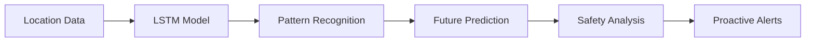

<div align="center">


# SafeSpot

### *Intelligent Geofencing with Predictive Safety*

[](https://flutter.dev/)
[](https://www.tensorflow.org/)
[](LICENSE)

*Real-time location tracking meets AI-powered movement prediction for proactive safety monitoring*

[Features](#-features) • [Getting Started](#-getting-started) • [LSTM Model](#-lstm-movement-prediction) • [Contributing](#-contributing)

</div>

---

## 📱 Overview

**SafeSpot** is a next-generation Flutter application that revolutionizes personal safety through intelligent geofencing and AI-powered movement prediction. By combining real-time location tracking with LSTM neural networks, SafeSpot doesn't just monitor where you are—it predicts where you're going and proactively alerts you to potential safety concerns.

Perfect for **personal safety**, **family monitoring**, and **device management** scenarios.

---

## ✨ Features

<table>
<tr>
<td width="50%">

### 🗺️ **Core Functionality**
- **Real-Time Location Tracking**  
  Monitor current location with interactive map visualization
  
- **Custom Geofence Creation**  
  Draw virtual boundaries by adding and moving points directly on the map
  
- **Smart Geofence Management**  
  Activate, deactivate, and delete zones with ease
  
- **Location History Tracking**  
  Analyze movement patterns over time

</td>
<td width="50%">

### 🤖 **AI-Powered Intelligence**
- **Movement Prediction**  
  LSTM neural networks predict future locations
  
- **Predictive Safety Alerts**  
  Proactive notifications before entering unsafe areas
  
- **Anomaly Detection**  
  Identifies unusual movement patterns
  
- **Adaptive Learning**  
  Continuously improves with more data

</td>
</tr>
</table>

### 🔐 **Security & Privacy**
- Secure user authentication
- Profile & device management
- **On-device model training** — Your data never leaves your phone
- **Privacy-first architecture** — Full control over data retention

---

## 🧠 LSTM Movement Prediction Model

SafeSpot's breakthrough feature: an intelligent prediction system that learns your movement patterns and keeps you safe proactively.

### 🔄 How It Works



1. **📊 Data Collection** — Gathers location points with coordinates, timestamps, speed, and direction
2. **🎯 Pattern Recognition** — Identifies recurring routes and typical destinations
3. **🔮 Future Prediction** — Predicts next locations up to 4 hours in advance
4. **⚠️ Safety Analysis** — Evaluates predicted paths against geofences

### 🎯 Key Benefits

| Feature | Benefit |
|---------|---------|
| 🚨 **Proactive Safety** | Alerts *before* unsafe situations arise |
| 🗺️ **Route Optimization** | Suggests safer alternatives based on patterns |
| 🔍 **Anomaly Detection** | Flags unusual movements that may indicate emergencies |
| 📈 **Adaptive Learning** | Improves accuracy with continued use |

### ⚙️ Technical Specifications

- ✅ **TensorFlow Lite** integration for on-device inference
- ✅ **Sequence-to-sequence LSTM** architecture optimized for time-series data
- ✅ **Privacy-focused design** with local training
- ✅ **Configurable horizons** (15 minutes to 4 hours)
- ✅ **Real-time updates** based on recent patterns

---

## 🚀 Getting Started

### Prerequisites

```bash
✓ Flutter SDK (latest stable)
✓ Android Studio or VS Code
✓ Android/iOS device or emulator
✓ TensorFlow Lite (auto-installed)
```

### Installation

```bash
# Clone the repository
git clone https://github.com/reymartjohneva/SafeSpot.git

# Navigate to project folder
cd safe_spot

# Install dependencies
flutter pub get

# Run the app
flutter run
```

> **📱 iOS Users:** Run `pod install` from the `ios/` directory for CocoaPods setup.

---

## 📦 Key Dependencies

| Package | Purpose |
|---------|---------|
| `flutter_map` | Interactive map rendering |
| `geolocator` | Real-time location services |
| `latlong2` | Geographic coordinate handling |
| `permission_handler` | Device permission management |
| `tflite_flutter` | On-device LSTM model inference |
| `ml_algo` | ML preprocessing & feature engineering |
| `collection` | Efficient location data structures |

---

## 🔒 Privacy & Data Protection

SafeSpot takes your privacy seriously:

- 🏠 **Local Training** — Models trained entirely on your device
- 🚫 **No Data Sharing** — Location data never leaves your phone
- 🔐 **Federated Learning Ready** — Future-proof privacy architecture
- ⏱️ **User-Controlled Retention** — You decide how long data is stored

---

## 🤝 Contributing

We welcome contributions! Here's how you can help:

1. 🍴 Fork the repository
2. 🌿 Create a feature branch (`git checkout -b feature/AmazingFeature`)
3. 💾 Commit your changes (`git commit -m 'Add AmazingFeature'`)
4. 📤 Push to the branch (`git push origin feature/AmazingFeature`)
5. 🔃 Open a Pull Request

### 🎯 Areas for Contribution

- 🧠 LSTM model improvements & optimization
- 🔬 Additional ML features (clustering, advanced anomaly detection)
- 🔐 Privacy-preserving ML techniques
- 📊 Model performance benchmarking

See [CONTRIBUTING.md](CONTRIBUTING.md) for detailed guidelines.

---

## 🙏 Acknowledgments

Special thanks to:

- **[Flutter](https://flutter.dev/) & [Dart](https://dart.dev/)** — Cross-platform foundation
- **[OpenStreetMap](https://www.openstreetmap.org/)** — Map data provider
- **[TensorFlow](https://www.tensorflow.org/)** — On-device ML capabilities
- **All SafeSpot contributors** — For ongoing support and innovation

---

<div align="center">

### 🌟 Star us on GitHub if SafeSpot helps keep you safe!

Made with ❤️ by the SafeSpot Team

[Report Bug](https://github.com/reymartjohneva/SafeSpot/issues) • [Request Feature](https://github.com/reymartjohneva/SafeSpot/issues) • [Documentation](https://github.com/reymartjohneva/SafeSpot/wiki)

</div>
